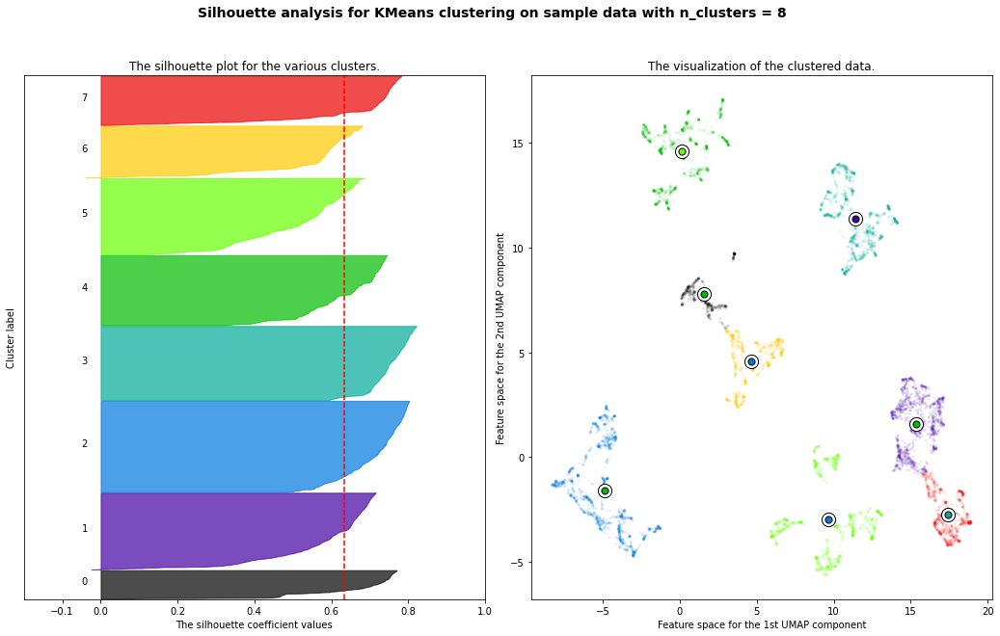
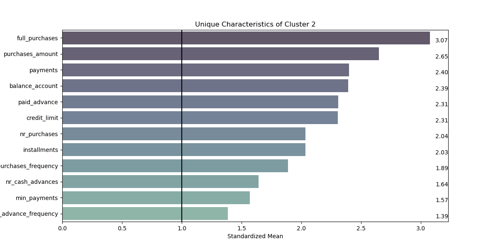
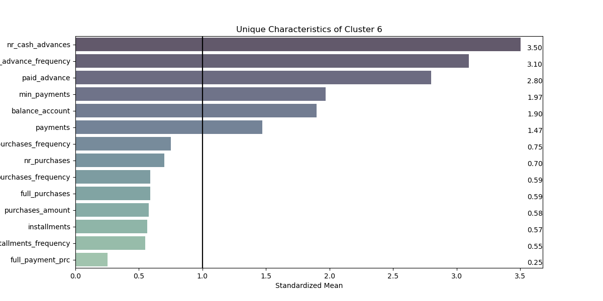

# Customer segmentation for Credit Card users
The dataset contains 8500 customers and their activity over a 6-month period. Each transaction is characterized by 18 features. This helps identifying different customer groups to improve the marketing campaigns.

## Exploratory data analysis
Examine how the different features distribute. Creation of a correlation matrix for the filtering of redundant information.

## Outlier detection
Various techniques and thresholds are used to filter outliers. The follwing techniques are used: 
- Cluster-Based Local Outlier Factor (CBLOF) 
- Isolation forest
- 1.5 IQR below Q1 or more than 1.5 IQR above Q3

This is done to improve the performance and reliability of algorithms that use a linear relationship between variables like PCA. Other algorithms, such as UMAP, are more robust against outliers.

## Clustering
A variety of dimensionality reduction techniques are used to find robust and meaningful clusters. We used the silhouette score to determine the best technique for determining a meaningful number of clusters. We used the following techniques:
- Uniform Manifold Approximation and Projection (UMAP)
- K-nearest neighbors (KNN)
- Principal Component Analysis (PCA)
- Hierarchical clustering

In the end, UMAP gave the best results, as you can see in the graph below. The different clusters are clearly visible.

## Interpretation
To make sense of the different clusters, we visualised the different characteristics. In order to be able to compare and analyse the characteristics in a relative context, we have used scaling. Only characteristics that differ by 20% or more from the mean are displayed.

  

    
     
  

